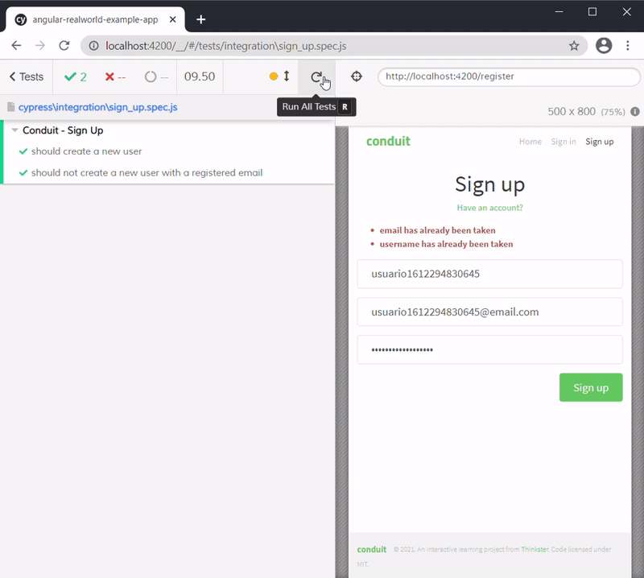
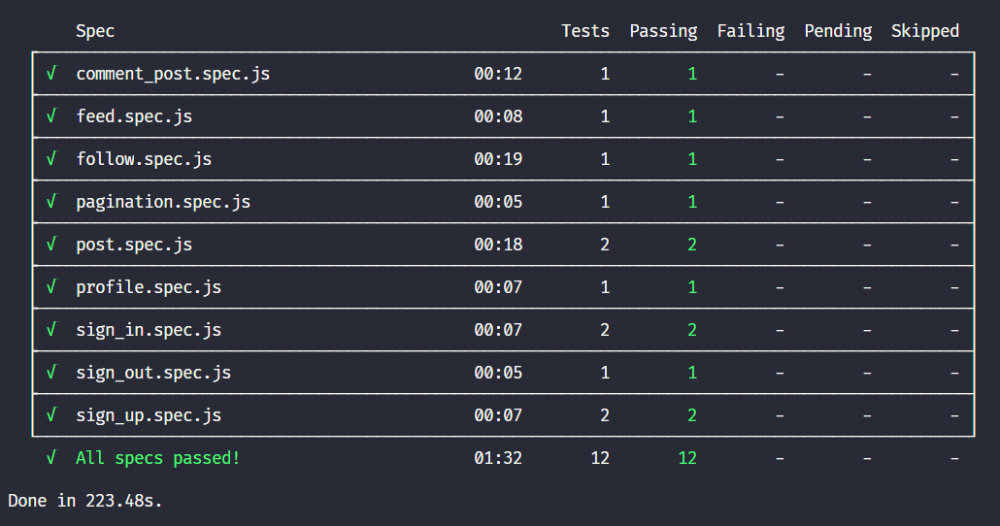

# Digital Innovation One

## Utilizando o Cypress E2E para testar um blog em Angular

Neste projeto foram criados testes de integração com o framework **Cypress**.

---

### 📝 Instruções

1 - Instale todas as dependências do projeto:

```console
yarn install
```

2 - Inicie o projeto Angular através do comando abaixo:

```console
yarn start
```

3- Selecione uma das opções abaixo para executar os testes:

- Execute os testes via **Cypress Test Runner** (interface gráfica) com o seguinte comando:

  ```console
  yarn cypress open
  ```

- Execute os testes individualmente via linha de comando:

  ```console
  yarn cypress run --spec ./cypress/integration/<arquivo-de-teste>
  ```

- Execute todos os testes via linha de comando:

  ```console
  yarn cypress run
  ```

---

### 📷 Screenshots

#### Cypress Test Runner




#### Relatório



---

### 📚 Referências

- [Angular](https://angular.io/)
- [Cypress](https://www.cypress.io/)
